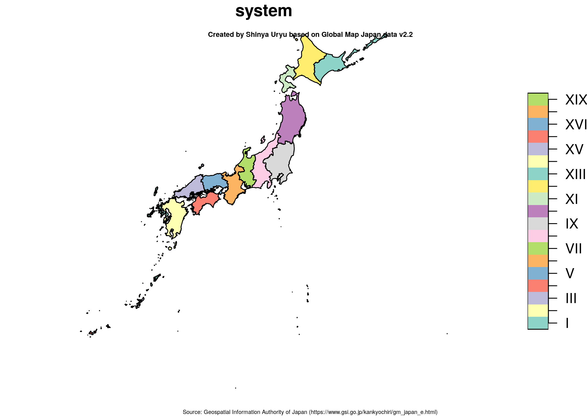
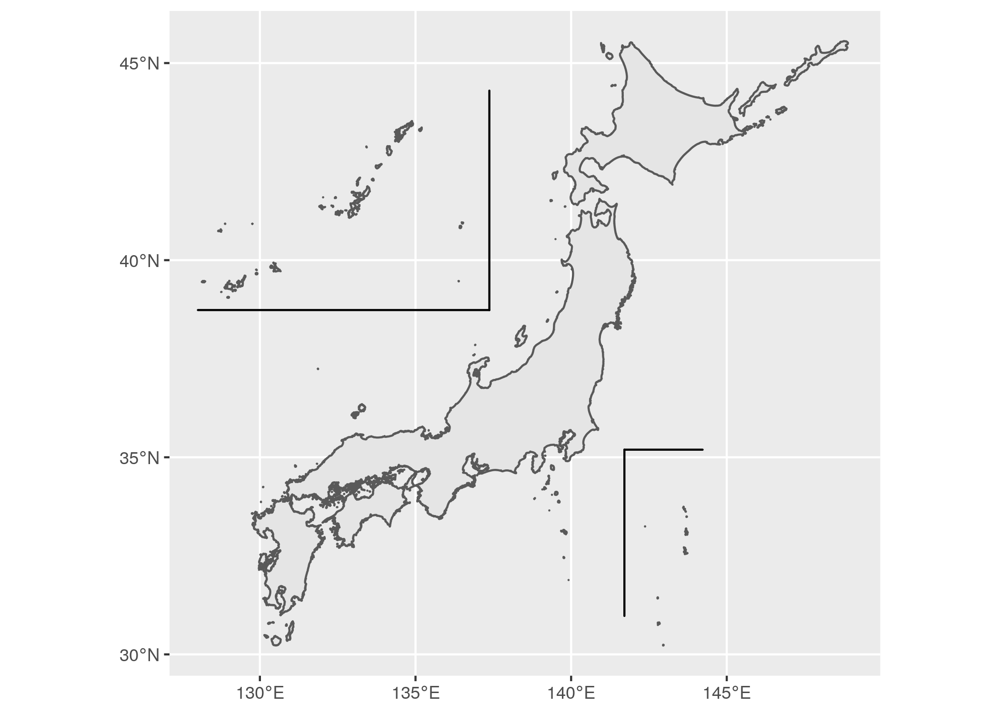

<!-- README.md is generated from README.Rmd. Please edit that file -->

```{r, include = FALSE}
knitr::opts_chunk$set(
  collapse = TRUE,
  comment = "#>",
  fig.path = "man/figures/README-",
  out.width = "100%"
)
```

# kuniezu

*国絵図 (kuniezu)*

<!-- badges: start -->
[](https://www.tidyverse.org/lifecycle/#experimental) [](https://cran.r-project.org/package=kuniezu)
[](https://cran.r-project.org/)

[](https://codecov.io/gh/uribo/kuniezu?branch=master)
<!-- badges: end -->

`{kuniezu}`は日本の国土地理に関する補助関数およびデータセットを提供するRパッケージです。

## インストール

GitHubより行ってください。remotesパッケージをインストールしたのち、`remotes::install_github()`でパッケージのインストールを行います。

``` r
install.packages("remotes")
remotes::install_github("uribo/kuniezu")
```

## 使い方

```{r example, echo=TRUE, message = FALSE}
library(kuniezu)
library(sf)
library(ggplot2)
```

**度分秒で表記される緯度経度のパース**

`北緯35度39分29秒1572`、`東経139度44分28秒8869`のように度分秒を使って示される緯度経度の値を十進数の表記に変換します。

```{r}
parse_lon_dohunbyo("東経139度44分28秒8869")
parse_lat_dohunbyo("北緯35度39分29秒1572")
```


**日本測地系2011平面直角座標での区域**

```{r jgd2011_area, eval = FALSE, echo = TRUE, dpi=300}
plot(jgd2011_bbox["system"])
title("Created by Shinya Uryu based on Global Map Japan data v2.2",
      sub = "Source: Geospatial Information Authority of Japan (https://www.gsi.go.jp/kankyochiri/gm_japan_e.html)",
      cex.main = 0.5,
      cex.sub = 0.4)
```



任意の座標が日本測地系2011の平面直角座標で示した際にどの区域に該当するかを判定します。

```{r, message = FALSE}
st_nearest_jgd2011(st_sfc(sf::st_point(c(140.778, 36.8)), 
                          crs = 4326))

st_detect_jgd2011(sf::st_sfc(sf::st_point(c(140.112, 36.083)),
                                     crs = 4326))
```

**南西諸島・小笠原諸島の位置を変更した地図の描画**

日本の地理空間データ（都道府県または市町村のレベルで分割されたジオメトリ）に対して適用します。

```{r move_jpsegment, eval = FALSE, echo = TRUE, dpi = 300}
move_jpn_rs(jgd2011_bbox) %>%
  st_union() %>% 
  ggplot() +
  geom_sf() +
  geom_jpsegment()
```


